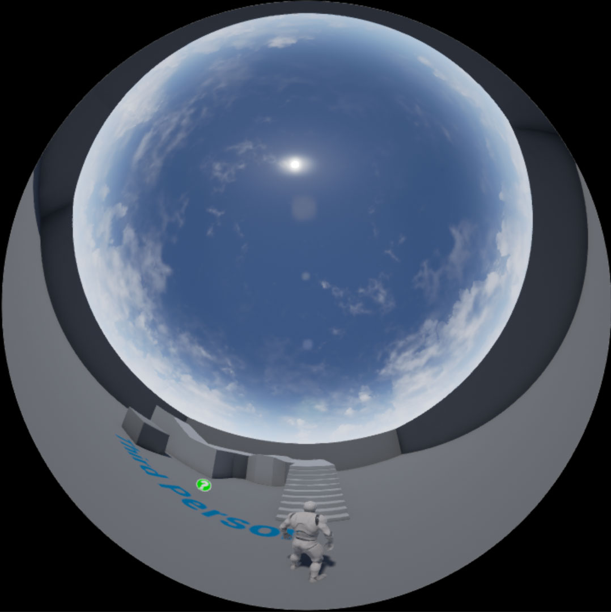

# UnrealDomemaster
Domemaster Template for Unreal Engine

Use:  
1. Close the project.  
2. In the Windows Explorer, copy the Domemaster folder to the project's Content folder.  
3. Restart the project.  
4. In Unity, drag the DomeCamera and Domemaster assets to the scene.  

Work in Progress. Test with the first and third-person templates.  

